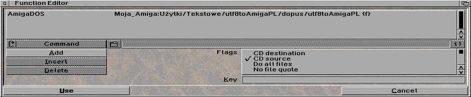

# UTF-8.to.AmigaPL.converter by tdolphin-org
## fork by MarX

### Introduction

Command line text files converter, from UTF-8 to AmigaPL. New file will be saved with *.apl* postfix.

Example usage:

**$ utf8toAmigaPL document.txt**

will produce **document.txt.apl** file.

### Dopus5 action:

Execute as AmigaDOS command with path to source file **{f}**.
Don't forget to add addictional flags:

* CD ource
* Rescan source

